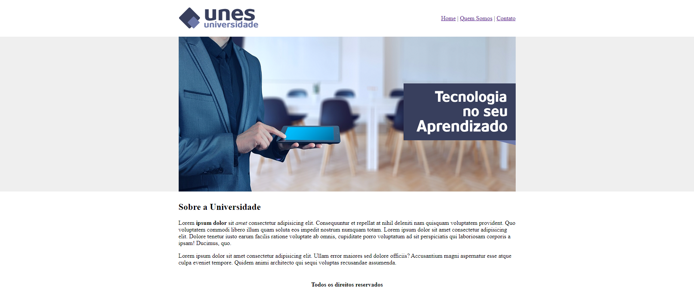

  

  <h3 align="center">Unes Universidade</h3>

  

## Sobre o projeto
### Tela inicial

</img>

### Recursos

Esses foram os recursos usados para o desenvolvimento:

- **HTML5** 

### Objetivo

Objetivo construir um site de universidade só com HTML para fins acadêmicos.

## License

This project is licensed under the MIT License - see the [LICENSE](https://opensource.org/licenses/MIT) page for details.
